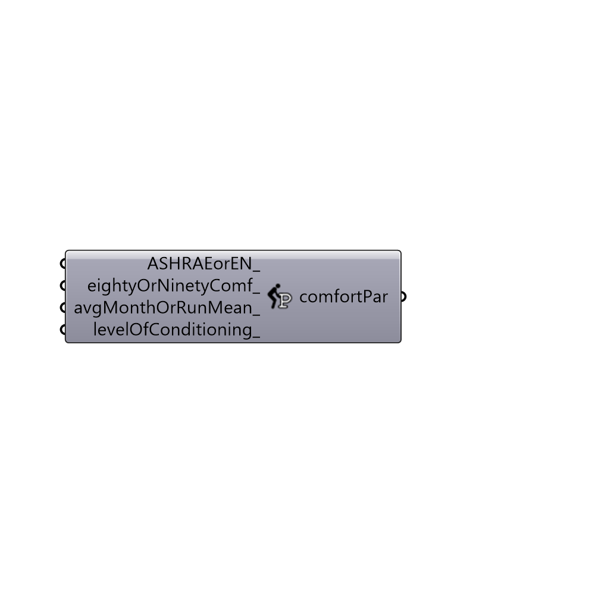

##  Adaptive Comfort Parameters

Use this component to set Adaptive comfort parameters for the Adaptive Comfort Calculator or the Adaptive Comfort Chart.  
 _
 Parameters include the ability to use either US (ASHRAE) or European (EN) standards as well as set the acceptability threshold for the percent of the occupants that are comfortable (which varies for different building types between the two standards).
 _
 This component also includes the ability to set a custom correlation between outdoor temperature and indoor desired temperature using a 'levelOfConditioning' variable and research that is not an official part of the ASHRAE or EN standards but is endorsed by many of the scientists who helped create these standards.
 _
 Detailed information on all of these parameters is described in this book:
 Fergus Nicol, Michael Humphreys, Susan Roaf. Adaptive Thermal Comfort: Principles and Practice. Routledge, 2012. (https://books.google.com/books?id=vE7FBQAAQBAJ&dq=adaptive+thermal+comfort)
 _
 Users are also encouraged to use the 'Ladybug_Adaptive Comfort Chart' component or the Center for the Built Environment's (CBE) comfort tool to help visualize the differences between these parameters:
 Special thanks goes to the authors of the online CBE Thermal Comfort Tool who first coded the javascript: Hoyt Tyler, Schiavon Stefano, Piccioli Alberto, Moon Dustin, and Steinfeld Kyle. http://cbe.berkeley.edu/comforttool/
 -
 

#### Inputs
* ##### ASHRAEorEN [Optional]
Set to 'True' to have the Adpative components use the US (ASHRAE 55 2013) adaptive standard and set to 'False' to have the Adaptive components use the European (EN-15251) standard.  The default is set to use the US (ASHRAE 55 2013) standard.  Note that changing the standard will also change some of the inputs below.  The ASHRAE standard will use the average monthly temperature by default and the European standard will use a running mean temperature by default.  Also, the European standard uses building classes instead of 80 / 90 percent acceptability.
* ##### eightyOrNinetyComf [Optional]
Set to 'True' to have the comfort standard be 80 percent of occupants comfortable and set to 'False' to have the comfort standard be 90 percent of all occupants comfortable.  The default is set to 'False' for 90 percent, which is what most members of the building industry seem to aim for in today's world.  However some projects will occasionally use 80% as this was originally the benchmark that engineers set around the dawn of air conditioning.
* ##### avgMonthOrRunMean [Optional]
Set to 'True' to have the Adpative components compute the prevailing outdoor temperature from the average monthly temperature (the official method used by the US's ASHRAE 55 2013) and set to 'False' compute the prevailing outdoor temperature from a weighted running mean of the last week (the official method used by Europe's EN-15251).  The default is set to align with the chosen comfort standard above (either ASHRAE 55 2013 or EN-15251) but this option is included to allow users to explore differences and variations between the two standards.
* ##### levelOfConditioning [Optional]
An optional number between 0 and 1 that represents how 'air conditioned' a space is. By default, this value is always set to 0 because both the ASHRAE 55 2013 and EN-15251 standards are strictly meant to be used for buildings without any installed air conditioning whatsoever.
 _
 However, the researchers who developed the original Adaptive models also surveyed many people in conditioned buildings to show that the adaptive model did not contradict the PMV model when it was applied to buildings that resembled the conditioned climate chamber used to validate the PMV model.  From these surveys of fully-conditioned buildings, researchers produced a correlation between prevailing outdoor temperature and desired indoor temperature that had a much shallower slope than that for fully naturally-ventilated buildings.  This input allows you to use this fully conditioned correlation (by setting this input to 1) or create any custom correlation in between these two (arguably representative of mixed-mode or hybrid AC/naturally ventilated buildings).
 _
 The conditioned building correlation used in the Ladybug Adaptive model can be found in the book refenced in the component description and specifically comes from this study:
 CIBSE (2006) Environmental Criteria for Design, Chapter 1: Environmental Design: CIBSE Guide A. London: Chartered Institution of Building Services Engineers.

#### Outputs
* ##### comfortPar
Comfort parameters that you can plug into either the "Ladybug_Adaptive Comfort Calculator" or the "Ladybug_Adaptive Comfort Chart."

[Check Hydra Example Files for Adaptive Comfort Parameters](https://hydrashare.github.io/hydra/index.html?keywords=Ladybug_Adaptive Comfort Parameters)