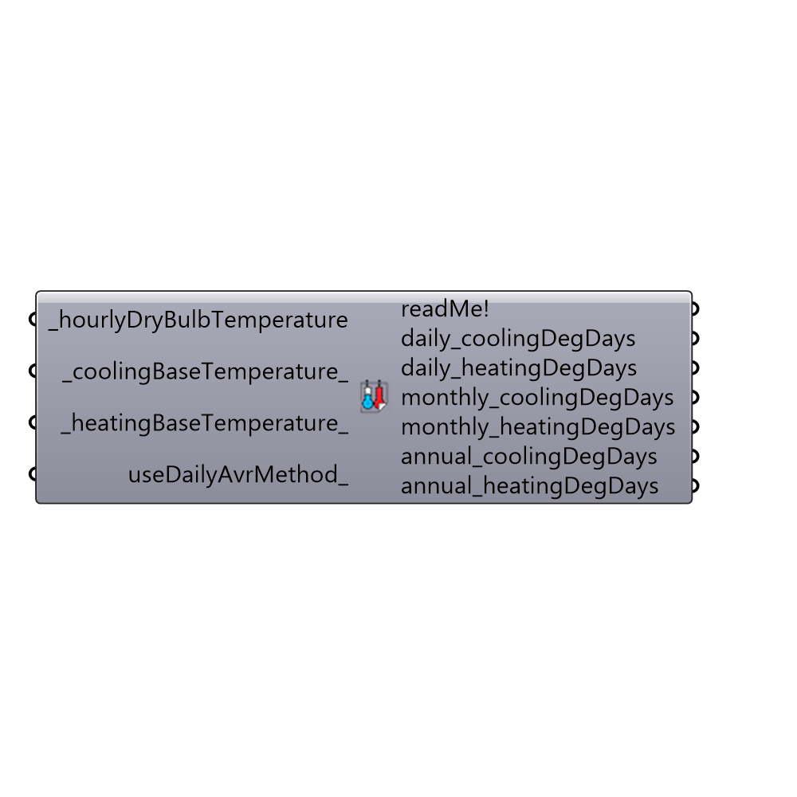

##  CDD_HDD

Calculates heating and cooling degree-days.
 Traditionally, degree-days are defined as the difference between a base temperature and the average ambient air temperature multiplied by the number of days that this difference exists.
 By default, this component uses a more accurate calculation than the traditional method based on the minimum and maximum temperature of each day.
 You may check the formulas in this page: "http://www.vesma.com/ddd/ddcalcs.htm"
 If you rather to use the traditional method, set useDailyAvrMethod to True.
 -
 

#### Inputs
* ##### hourlyDryBulbTemperature [Required]
Annual dry bulb temperature from the Import epw component (in degrees Celsius).
* ##### coolingBaseTemperature [Default]
Base temperature for cooling (in degrees Celsius).  Default is set to 23.3C but this can be much lower if the analysis is for a building with high heat gain or insulation.
* ##### heatingBaseTemperature [Default]
Base temperature for heating (in degrees Celsius).  Default is set to 18.3C but this can be much lower if the analysis is for a building with high heat gain or insulation.
* ##### useDailyAvrMethod [Optional]
set to "True" to use the traditional method of degree days calculation, which will calculate the average temperature of each day and sum up all of these temperatures over the year.  This is opoosed to this component's default analysis, which will will examine each hour of the year and then convert results to degree-days.

#### Outputs
* ##### readMe!
A summary of the input.
* ##### daily_coolingDegDays
Cooling degree-days summed for each day of the year. For visualizations of over the whole year, connect this to the grasshopper chart/graph component. 
* ##### daily_heatingDegDays
Heating degree-days summed for each day of the year. For visualizations of over the whole year, connect this to the grasshopper chart/graph component. 
* ##### monthly_coolingDegDays
Cooling degree-days summed for each month of the year.
* ##### monthly_heatingDegDays
Heating degree-days summed for each month of the year.
* ##### annual_coolingDegDays
The total cooling degree-days for the entire year.
* ##### annual_heatingDegDays
The total heating degree-days for the entire year.

[Check Hydra Example Files for CDD_HDD](https://hydrashare.github.io/hydra/index.html?keywords=Ladybug_CDD_HDD)