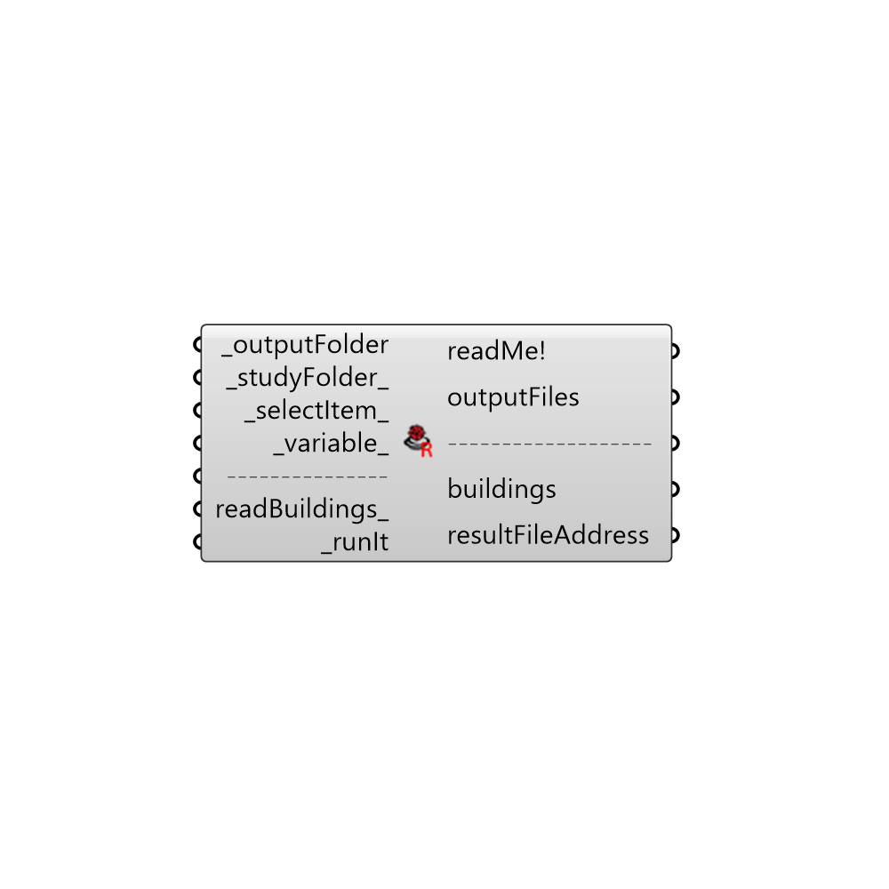

##  ENVI-Met Reader

This component generate readable output files of ENVI-Met v4.0 for Ladybug.
 -
 Component mainly based on:
 https://www.researchgate.net/publication/281031049_Outdoor_Comfort_the_ENVI-BUG_tool_to_evaluate_PMV_values_point_by_point
 -
 Special thanks goes to MIT.
 -
 

#### Inputs
* ##### outputFolder [Required]
ENVI-Met output folder path. E.g. 'C:\...\NewSimulation_output'.
* ##### studyFolder [Default]
ENVI-Met sub-folder, connect a number from 0 to 4. Default value is 0. - 0 = atmosphere 1 = pollutants 2 = radiation 3 = soil 4 = surface
* ##### selectItem [Default]
Connect an integer number which represent the index of the file you want to read. Plug a panel to 'outputFiles' to see them. - Default value is 0, the first file in ENVI-Met model folder.
* ##### variable [Default]
Select one variable. - 1 = Flow u (m/s) 2 = Flow v (m/s) 3 = Flow w (m/s) 4 = Wind Speed (m/s) 5 = Wind Speed Change () 6 = Wind Direction (deg) 7 = Pressure Perturbation (Diff) 8 = Air Temperature (C) 9 = Air Temperature Delta (K) 10 = Air Temperature Change (K/h) 11 = Spec. Humidity (g/kg) 12 = Relative Humidity () 13 = TKE (m/m) 14 = Dissipation (m/m) 15 = Vertical Exchange Coef. Impuls (m/s) 16 = Horizontal Exchange Coef. Impuls (m/s) 17 = Vegetation LAD (m/m) 18 = Direct Sw Radiation (W/m) 19 = Diffuse Sw Radiation (W/m) 20 = Reflected Sw Radiation (W/m) 21 = Temperature Flux (Km/s) 22 = Vapour Flux (g/kgm/s) 23 = Water on Leafes (g/m) 24 = Leaf Temperature (C) 25 = Local Mixing Length (m) 26 = Mean Radiant Temp. (C) 27 = TKE normalised 1D ( ) 28 = Dissipation normalised 1D ( ) 29 = Km normalised 1D ( ) 30 = TKE Mechanical Turbulence Prod. ( ) 31 = Stomata Resistance (s/m) 32 = CO2 (mg/m3) 33 = CO2 (ppm) 34 = Plant CO2 Flux (mg/kgm/s) 35 = Div Rlw Temp change (K/h)
* ##### readBuildings [Optional]
Set to "True" to read and visualize ENVI-Met buildings.
* ##### runIt [Required]
Set to "True" to run the component and perform ENVI-Met data visualization.

#### Outputs
* ##### readMe!
...
* ##### outputFiles
File list that you can read.
* ##### buildings
Script variable ENVI-MetReader
* ##### resultFileAddress
Connect this output to "ENVI-Met visualizer".

[Check Hydra Example Files for ENVI-Met Reader](https://hydrashare.github.io/hydra/index.html?keywords=Ladybug_ENVI-Met Reader)