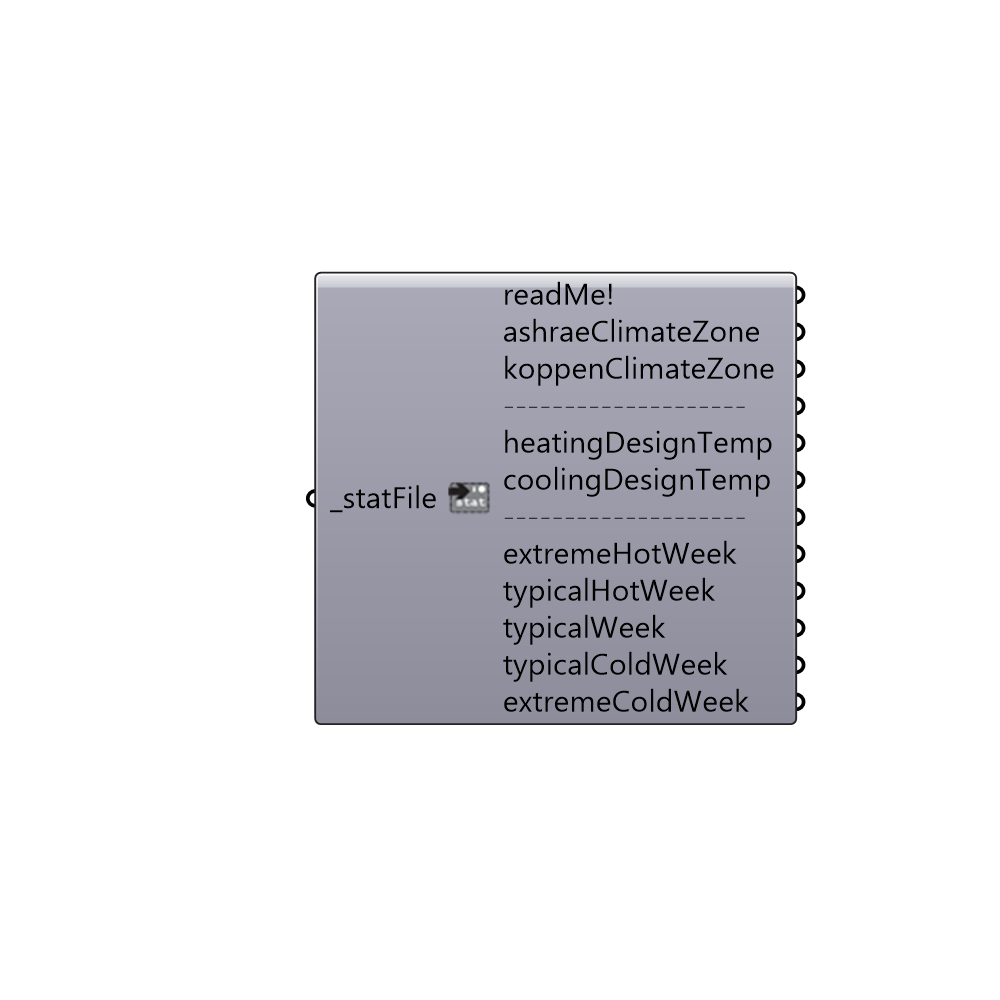

##  Import_stat

Use this component to import climate data found in the .stat file that downloads with the .epw file (in the same .zip folder).
 Sepcifcally, this allows you to import the ASHRAE and Koppen climate zones as well as design temperatures representing the temperature extremes of the climate that should be used to design and size heating and cooling systems.
 Lastly, this component brings in the typical and extreme weeks of the year as ladybug analysis periods that can be plugged into the other ladybug components.
 -
 

#### Inputs
* ##### statFile [Required]
A .stat file path on your system from the Open STAT file component (or typed out as a string).

#### Outputs
* ##### readMe!
...
* ##### ashraeClimateZone
The estimated ASHRAE climate zone of the STAT file.  ASHRAE climate zones are frequently used to make suggestions for heating and cooling systems and correspond to recommendations for insulation levels of a building.  For more information, see this pdf: https://www.ashrae.org/File%20Library/docLib/Public/20081111_CZTables.pdf
* ##### koppenClimateZone
The estimated Koppen climate zone of the STAT file.  The Koppen climate classification is the most widely used climate classification system and is based on the concept that native vegetation is the best expression of climate. Thus, Koppen climate zones combine average annual and monthly temperatures, precipitation, and the seasonality of precipitation.  For more information, see the wikipendia page on Koppen climate: http://en.wikipedia.org/wiki/K%C3%B6ppen_climate_classification.
* ##### heatingDesignTemp
The temperature in Celcius that ASHRAE recommends using to design a heating system for a building.  It rempresents the one of the coldest temperatures of the year for which only 0.4% of the hours are below.
* ##### coolingDesignTemp
The temperature in Celcius that ASHRAE recommends using to design a cooling system for a building.  It rempresents the one of the hottest temperatures of the year for which only 0.4% of the hours are above.
* ##### extremeHotWeek
An analysis period representing the hottest week of the typical mean year.  If the stat file does not specify an extreme hot week, it is the most extreme week of the hottest season.
* ##### typicalHotWeek
An analysis period representing a typical week of the hottest season in the typical mean year.  Not all stat files specify such a week and, in this case, the output here will be "Null."
* ##### typicalWeek
An analysis period representing a typical week of the typical mean year.  If the stat file does not specify a typical week, it is the typical week of Autumn.
* ##### typicalColdWeek
An analysis period representing a typical week of the coldest season in the typical mean year.  Not all stat files specify such a week and, in this case, the output here will be "Null."
* ##### extremeColdWeek
An analysis period representing the coldest week of the typical mean year.  If the stat file does not specify an extreme cold week, it is the most extreme week of the coldest season.

[Check Hydra Example Files for Import stat](https://hydrashare.github.io/hydra/index.html?keywords=Ladybug_Import stat)