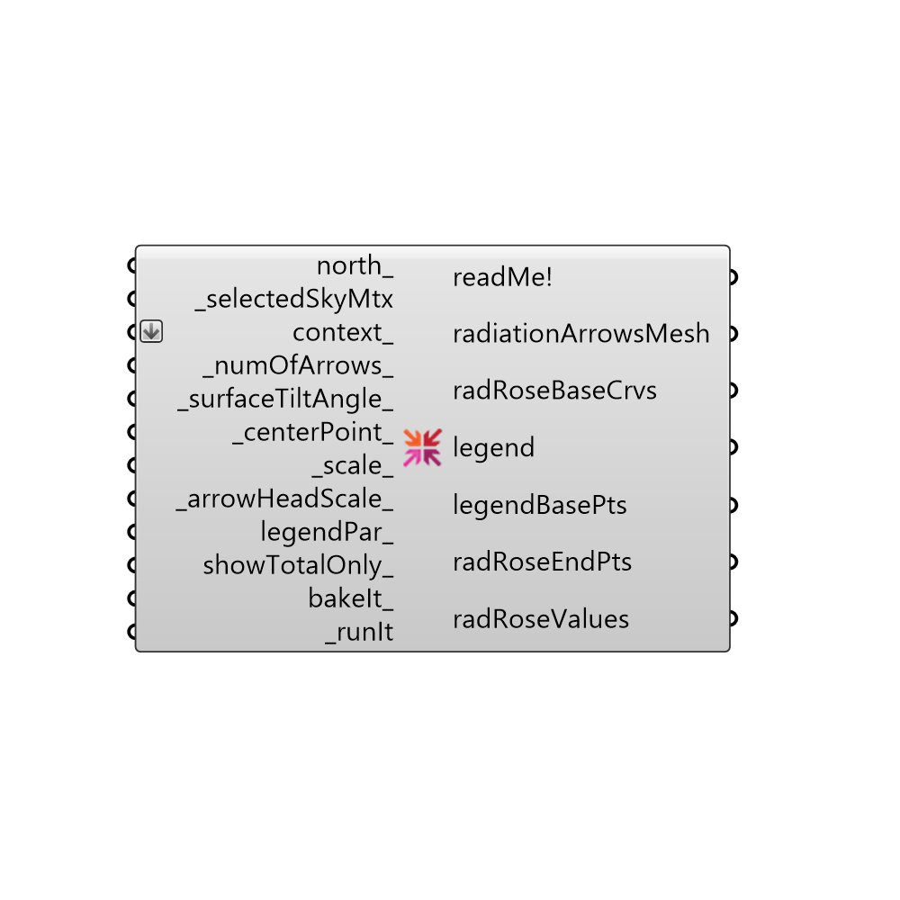

##  Radiation Rose

Use this component to make a radiation rose in the Rhino scene.  Radiation roses give a sense of how much radiation comes from the different cardinal directions, which will give an initial idea of where glazing should be minimized, shading applied, or solar collectors placed.
 -
 

#### Inputs
* ##### north [Optional]
Input a vector to be used as a true North direction for the sun path or a number between 0 and 360 that represents the degrees off from the y-axis to make North.  The default North direction is set to the Y-axis (0 degrees).
* ##### selectedSkyMtx [Required]
The output from the selectSkyMtx component.
* ##### context [Optional]
Optional breps or meshes representing context surrounding the point at the center of the radiation rose.  This context geometry will block the radiation that shows up in the rose.
* ##### numOfArrows [Default]
An interger that sets the number of arrows (or cardingal directions) in the radiation rose. The default is set to 36.
* ##### surfaceTiltAngle [Default]
A number between 0 and 90 that sets the tilt angle in degrees of the analysis plane (0 = roof, 90 = vertical wall). The defult is set to 90 for a radiation study of a wall (ie. radiation on a curtain wall).
* ##### centerPoint [Default]
A point that sets the location of the radiation rose.  The default is set to the Rhino origin (0,0,0).
* ##### scale [Default]
Use this input to change the scale of the radiation rose.  The default is set to 1 for any selSkyMtx that is longer than a day and 1000 for any selSkyMtx that is less than a day.
* ##### arrowHeadScale [Default]
Use this input to change the scale of the arrow heads of the radiation rose.  The default is set to 1.
* ##### legendPar [Optional]
Optional legend parameters from the Ladybug Legend Parameters component.
* ##### showTotalOnly [Optional]
Set to "True" to only show a radiation rose with the total radiation.  The default is "False", which will produce 3 radiation roses: one of diffuse radiation, one of direct radiation, and one of the total radiation.
* ##### runIt [Required]
Set to "True" to run the component and generate a radiation rose.
* ##### bakeIt [Optional]
Set to "True" to bake the radiation rose into the Rhino scene.

#### Outputs
* ##### readMe!
...
* ##### radiationArrowsMesh
A colored mesh representing the intensity of radiation from different cardinal directions.
* ##### radRoseBaseCrvs
A set of guide curves that mark the directions of radiation analysis.
* ##### legend
A legend of the radiation rose. Connect this output to a grasshopper "Geo" component in order to preview the legend separately in the Rhino scene.  
* ##### legendBasePts
The legend base point(s), which can be used to move the legend(s) in relation to the rose with the grasshopper "move" component.
* ##### radRoseEndPts
The end points of the rose arrows.
* ##### radRoseValues
The radiation values in kWh/m2 for each rose arrow.

[Check Hydra Example Files for Radiation Rose](https://hydrashare.github.io/hydra/index.html?keywords=Ladybug_Radiation Rose)