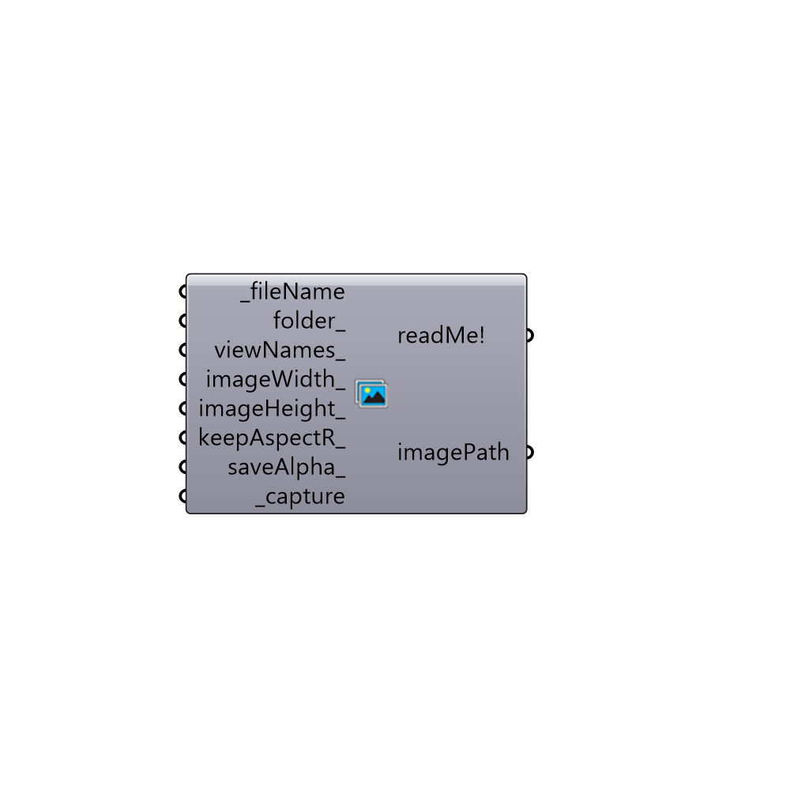

##  Render View

Use this component to render Rhino views and save them to your hard drive.  This component is fully-functional with both Rhino Render and V-Ray for Rhino.  Other rendering plugins may still work but are not fully supported yet.
 _
 This component is particularly useful if you are trying to create animations of Grasshopper geometry and want to automate the capturing of views.
 -
 

#### Inputs
* ##### fileName [Required]
The file name that you would like the image to be saved as.  Note that, for animations, you want to make sure that each saved images has a different filename otherwise the previous image will be overwritten by each successive image.
* ##### folder [Optional]
The folder into which you would like to write the image file.  This should be a complete file path to the folder.  If no folder is provided, the images will be written to C:/Ladybug/Capturedviews/.
* ##### viewNames [Optional]
The Rhino viewport name which you would like to render.  Acceptable inputs include "Perspective", "Top", "Bottom", "Left", "Right", "Front", "Back" or any view name that you have already saved within the Rhino file (note that you do not need to input quotations).  If no text is input here, the default will be an image of the active viewport (or the last viewport in which you navigated).
* ##### imageWidth [Optional]
The width of the image that you would like to render in pixels.  If no value is provided here, the component will set the width to that of the active Rhino viewport on your screen.
* ##### imageHeight [Optional]
The height of the image that you would like to render in pixels.  If no value is provided here, the component will set the height to that of the active Rhino viewport on your screen.
* ##### keepAspectR [Optional]
Set to "True" to keep the aspect ratio of the viewport in the images that you save.  By default, this is set to "False" if you have connected an imageHeight_ but will override this input to ensure correct aspect ratio if set to "True".
* ##### saveAlpha [Optional]
Set to "True" to have an alpah image saved next to the RGB rendering and set to "False" to have only have the RGB image saved.  The default is set to "False" to only save the RGB.
* ##### capture [Required]
Set to "True" to render the image and save it to your hard drive.

#### Outputs
* ##### readMe!
The filepath of the image taken with this component.
* ##### imagePath
The filepath of the image taken with this component.

[Check Hydra Example Files for Render View](https://hydrashare.github.io/hydra/index.html?keywords=Ladybug_Render View)