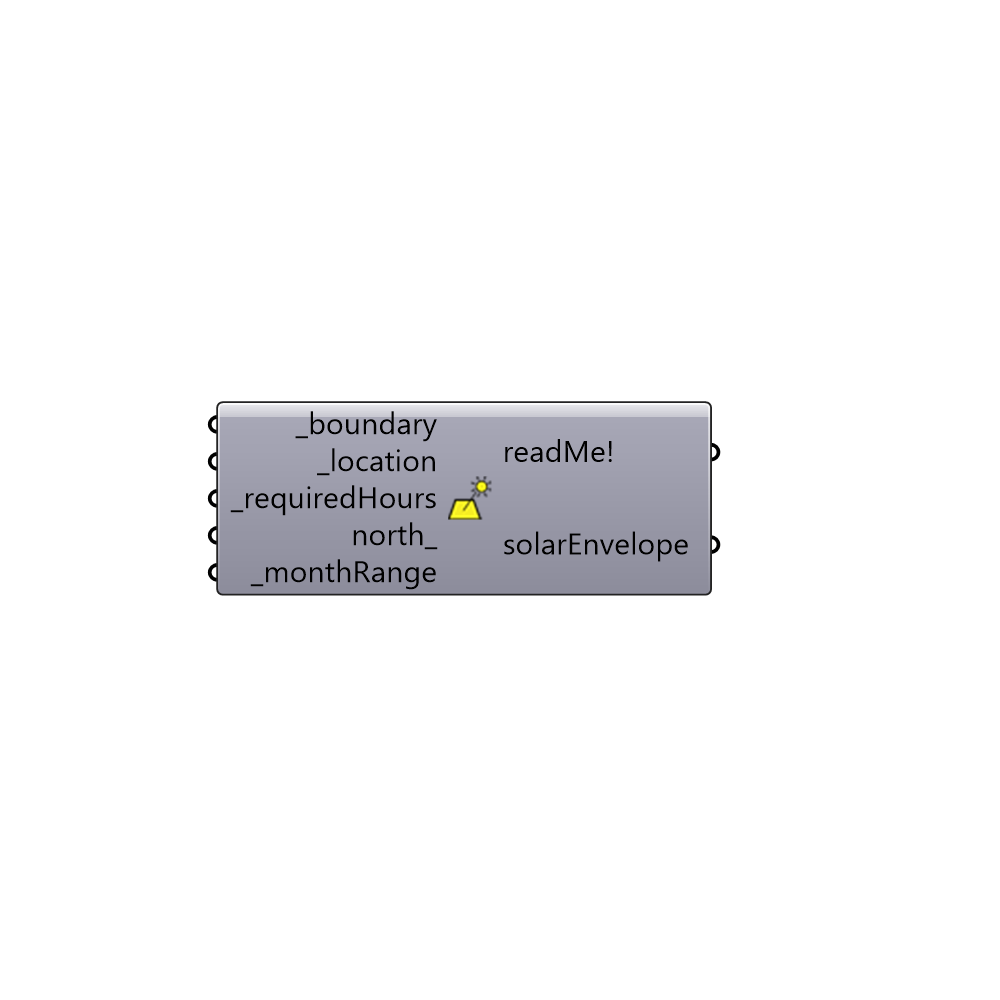

##  SolarEnvelopeBasic

Use this component to generate a solar envelope for a closed boundary curve with minimum inputs. This component predefines monthly and hourly ranges in order to simplify the creation of useful envelope geometry.  
 The solar envelope is used to ensure that its adjacent neighbors (defined as anything outside of the chosen boundary curve) will receive a specified minimum hours of direct solar access for each day in a specified month range of the year.
 Any geometry built within the solar envelope boundaries will therefore not cast any shadow on adjacent property for the given hour and month range.
 The start and end dates that determine the month range for solar access can be chosen from the following options:
 0) Mar 21 - Jun 21
 1) Mar 21 - Sep 21
 2) Mar 21 - Dec 21
 3) Jun 21 - Sep 21
 4) Jun 21 - Dec 21
 5) Sep 21 - Dec 21
 The default set to 4) June 21 to December 21.
 Reference: Niemasz, J., Sargent, J., Reinhart D.F., "Solar Zoning and Energy in 
 Detached Residential Dwellings," Proceedings of SIMAUD 2011, Boston, April 2011.
 -
 

#### Inputs
* ##### boundary [Required]
A closed boundary curve representing a piece of land (such as a property to be developed) for which solar access of the surrounding land is desired.
* ##### location [Required]
The output from the importEPW or constructLocation component.  This is essentially a list of text summarizing a location on the earth.
* ##### requiredHours [Required]
The number of hours of direct solar access that the property surrounding the boundary curve should receive during the _monthRange. For example an input of 4 will define the hour range roughly between 10AM and 2PM. The component will compute the hour range that will maximize the envelope volume.        
* ##### north [Optional]
Input a vector to be used as a true North direction or a number between 0 and 360 that represents the degrees off from the y-axis to make North.  The default North direction is set to the Y-axis (0 degrees).
* ##### monthRange [Required]
An optional interger value to change the month range for which solar access is being considered. The default month range is Jun 21 - Dec 21.
 Integers input here must be between 0 - 5 and correspond to the following :
 ---
 0 = Mar 21 - Jun 21
 1 = Mar 21 - Sep 21
 2 = Mar 21 - Dec 21
 3 = Jun 21 - Sep 21
 4 = Jun 21 - Dec 21
 5 = Sep 21 - Dec 21
 ---
 Where, in the North/South Hemispheres, these dates repsectively signify:
 Mar 21 = Vernal/Autumnal Equinox
 Jun 21 = Summer/Winter Solstice
 Sep 21 = Autumnal/Vernal Equinox
 Dec 21 = Winter/Summer Solstice

#### Outputs
* ##### readMe!
...
* ##### solarEnvelope
A Brep representing a solar envelope.  This volume should be built within in order to ensure that the surrounding property is not shaded for the given number of hours.

[Check Hydra Example Files for SolarEnvelopeBasic](https://hydrashare.github.io/hydra/index.html?keywords=Ladybug_SolarEnvelopeBasic)