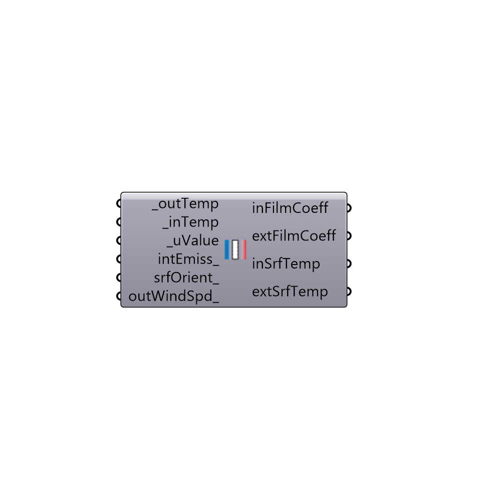

##  Steady State Surface Temperature

Use this component to calculate a steady state interior/exterior surface temperature from given given indoor/outdoor air temperatures and surface U-Values.  Note that this component does not currently account for solar radiation, which can greatly alter surface temperatures in the real world.
 _
 The formulas used to account for air film resistance in this component come from ASHRAE Fundementals 2013, Chapter 26, Table 10 (26.20).
 -
 

#### Inputs
* ##### outTemp [Required]
A number (or list of numbers) that represent the outdoor air temperature in degrees Celcius.
* ##### inTemp [Required]
A number (or list of numbers) that represent the indoor air temperature in degrees Celcius.
* ##### uValue [Required]
A number that represents the U-Value of the surface dividing the interior and exterior in SI (W/K·m2).
* ##### intEmiss [Optional]
A number between 0 and 1 that represents the interior emissivity of the surface dividing the interior and exterior.  The default is set to 0.9 for a non-metallic surface.
* ##### srfOrient [Optional]
A number between 180 (downwards) and -180 (upwards) that represents the angle in degrees of the direction of heat flow.  This is related to the orientation of the surface dividing the interior and exterior. This input can also be the normal vector of a surface that is facing the correct direction of heat flow.  The default is set to 0 degrees for a verically-oriented surface (horizontal heat flow).
* ##### outWindSpd [Optional]
A number (or list of numbers) that represents the outdoor wind speed in m/s.  This is used to calculate the outdoor film coefficient.  If no value is input here, a default of 6.7 m/s will be assumed (indicating a winter design day).

#### Outputs
* ##### inFilmCoeff
The interior film coefficient as calculated by the interior emissivity, surface orientation and Chapter 26, Table 10 of AHSHRAE Fundemantals.
* ##### extFilmCoeff
Script variable ssSrfTemp
* ##### inSrfTemp
The steady state interior surface temperature in degrees Celcius.
* ##### extSrfTemp
The steady state exterior surface temperature in degrees Celcius.

[Check Hydra Example Files for Steady State Surface Temperature](https://hydrashare.github.io/hydra/index.html?keywords=Ladybug_Steady State Surface Temperature)